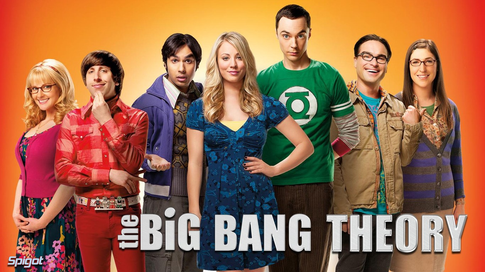

 
Año: 2007
Duración: 20 min.
País: Estados Unidos
Reparto: Johnny Galecki, Jim Parsons, Kaley Cuoco, Simon Helberg, Kunal Nayyar, Melissa Rauch, Mayim Bialik
 
 
Trece años han pasado desde que allá por el 2007 se estrenase The Big Bang Theory, una serie un tanto peculiar convertida hoy en un fenómeno fan y, porqué no decirlo, una serie de culto.

Tras ocho temporadas en antena y una larga lista de nominaciones y premios ganados ininterrumpidamente de 2009 a 2014 (por nombrar algunos, varios galardones a la Mejor Comedia de Televisión y otros tantos al Mejor Actor Protagonista de una serie de comedia para Jim Parsons), la serie no ha perdido un ápice de la chispa y nivel de frikismo con el que comenzó. Capítulo a capítulo hace referencia a símbolos de la cultura friki popular: películas y series como Star Wars, Star Trek, Firefly, videojuegos como Halo, Age of Conan, las míticas camisetas de Sheldon del superhéroe Flash o la cantidad de veces que hemos visto a sus protagonistas disfrazados. Por no hablar de cameos de la talla de Stan Lee, Stephen Hawking, Leonard Nimoy, Nathan Fillion o Charlie Seen. Y no son sólo sus guiños al frikismo lo que la convierte en una serie de éxito, sino el cariño que hemos cogido a sus personajes durante estos años.

Al comienzo de la primera temporada conocimos a sus protagonistas, Sheldon Cooper (Jim Parsons) y Leonard Hofstader (Johnny Galecki), dos doctores en física que trabajan en la universidad de Pasadena, y que además comparten piso. Un buen día conocen a su vecina Penny (Kaley Cuoco), una camarera intentando convertirse en actriz, aunque sin mucho éxito. El reparto principal se completa con Howard Wolowitz (Simon Helberg), ingeniero judío, y Rajesh Koothrappali (Kunal Nayyar), astrofísico, ambos compañeros de trabajo y de frikadas de Sheldon y Leonard.

No es hasta la tercera temporada cuando conocemos a Bernadette Rostenkowski (Melissa Rauch), microbióloga, compañera de trabajo de Penny y futura mujer de Howard. En el último episodio de la misma temporada conocemos a Amy Farrah Fowler (Mayim Bialik, a la que recordaréis de la famosa serie de los 90 Blossom), neurobióloga y futura no-novia/novia de Sheldon. De esta forma queda cerrado el elenco principal, aunque a lo largo de la serie aparecen de manera recurrente personajes secundarios como Stuart Bloom (Kevin Sussman), dueño de la tienda de cómics, Aarti Mann como Priya Koothrappali (hermana de Rajesh) o el actor Wil Wheaton interpretándose a sí mismo.

A lo largo de sus ocho temporadas (y las que quedarán) hemos visto infinidad de noviazgos fugaces (y no todos por parte de la alegre Penny), peleas entre amigos, visitas parentales, mucha comida basura y sobre todo mucho frikismo. Hemos conocido a fondo a cada personaje: donde viven, donde trabajan, sus aficiones y sobre todo, las cosas que les han llevado a ser como son. Y son estas pequeñas cosas, la calidad de la serie y la duración de sus episodios (de unos 20 minutos de media) lo que hace que no quieras parar de verla.
