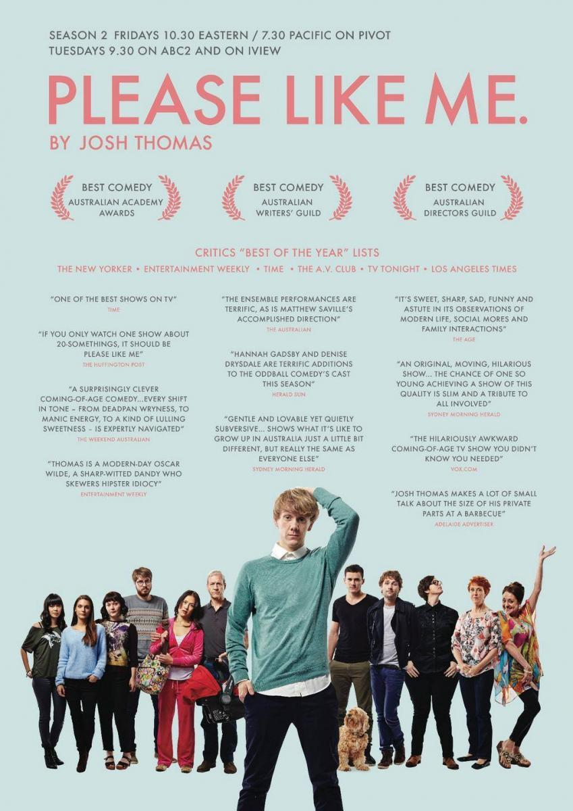

Después de terminar la cuarta temporada ayer mismo, me veo en la obligación de hacer una crítica de esta serie; empezó suave en mí y ha acabado convirtiéndose en mi top actual en emisión. Sí, habrá quinta temporada. ¡BIEN!

¿No sabes de qué va?

La premisa puede parecer típica, facilona e incluso superficial a primera vista, pero en realidad está bien escrita y llena de verdad. Josh acaba de cumplir 21 años y ese mismo día le abandona la novia, alegando que le deja porque cree que es gay y no lo sabe. Ese mismo día conoce a un atractivo chico que se siente atraído por él, pero Josh es tan inseguro que no puede creerse que se interese por él, por lo que autoboicotea toda posibilidad de que las cosas salgan bien. También resulta interesante la idea de esos padres, que cuando uno va creciendo, dejan de ser héroes para pasar a ser unos personas normales que no siempre tienen idea de lo que están haciendo.

Dicen que se parece a “Girls”, no puedo opinar porque no he visto esa serie (ni creo que la vea).

El resumen fácil podría ser: La vida de Josh. El protagonista es un ser detestable, egocéntrico, antipático y que carece de empatía. Junto con esas joyas, que probablemente se acerquen mucho a su personalidad real, es también es guionista brillante que ha sabido sacar adelante él solo todo el proyecto.

Hablamos de una serie que casi podría considerarse “indie”. Su título: “Please Like Me”, complicado de traducir literalmente en español, pero que sería algo así como “Por favor, quiero gustarte”. Un título patético y desesperado que ya nos muestra alguien con serios problemas para encajar con su entorno. ¿Comedia pura? ¡Nunca!

Pese a ser una comedia, que tira sobre todo de la ironía, encontramos los momentos dramáticos tan típicos australianos. Si te gustó “La boda de Muriel”, te encantará esta serie que busca el equilibrio entre comedia y drama, un drama profundo que llega cuando te encariñas con los personajes tanto que llegan a dolerte.
¿Secundarios?

Claro, para mí son lo mejor de Please Like me.

Tom, el mejor (y único) amigo hetero que un gay pudiera tener, inmaduro y con problemas de compromiso crónicos, nunca decepciona en los momentos de verdad. Comparten piso y si hay alguien con una vida amorosa más patética que el protagonista es él.

Geoffrey, también conocido en mi casa como Dios, es el incomprensible “amor guadiana” de Josh que haría las delicias de cualquier persona normal, lo que él no es su búsqueda de una personalidad que esconde mucho más de lo que parece.

Arnold, otro incomprensible ligue del protagonista con problemas mentales graves. Lucha contra su propia personalidad destructiva y el entorno hostil, pero siempre hay esperanza, ¿o no?

Claire, exnovia de Josh. Pasa en un segundo de ser su hipotética amante a ocupar el lugar que siempre tuvo, el de mejor amiga mariliendre.

Siguen los padres, tíos, madrastra, Hanna, etc… ninguno tiene desperdicio. 

¡No puedes perdértela!

