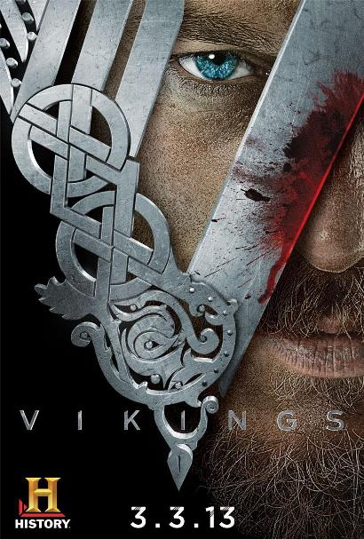

    
   

    
 
Año: 2013  
Duración: 44 min.  
País: Irlanda
Reparto: Travis Fimmel, Katheryn Winnick, Clive Standen, Jessalyn Gilsig, Gustaf Skarsgård,   Gabriel Byrne, George Blagden, Donal Logue
 
Sinopsis:
Vikingos es una de las series de aventuras más exitosas de los últimos años. 
Creada y escrita por Michaelk Hirst, está inspirada en las sagas de Ragnar Lodbrok, uno de los héroes nórdicos más legendarios. Un granjero que, en las primeras temporadas alcanza fama como navegante y que se convierte en rey. 
Las últimas temporadas de la serie se centran en sus hijos y en sus aventuras en Inglaterra, Escandinavia y el Mediterráneo.
Intrigas, guerras, aventuras… La mezcla de acción, drama y aventura ha hecho de Vikingos una serie de referencia.
