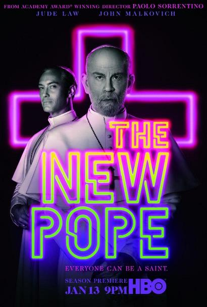

    
  

    
  
Año: 2020  
Duración: 60 min.  
País: Italia  
Reparto: John Malkovich, Jude Law, Silvio Orlando, Cécile De France, Javier Cámara
 
Sinopsis: 
El Papa Pío XIII está en coma. Tras un breve interludio de incertidumbre, Voiello logra que se elija a Sir John Brannox (John Malkovich) como su sucesor, un moderado, sofisticado y encantador aristócrata inglés que asume su nuevo rol bajo el nombre de Juan Pablo III. Aunque el nuevo Papa parece ser perfecto, sus allegados no tardan en descubrir sus debilidades y secretos. Mientras tanto, Voiello lucha por tapar los escándalos que azotan a la institución eclesiástica. De seguir así, la Iglesia corre el riesgo de desaparecer junto a todos sus altos cargos, algo de lo que dos mujeres, Sofia y Esher, parecen ser plenamente conscientes. 
Todo parece seguir su curso natural hasta que un día comienzan a aparecer una serie de mensajes firmados por Pío XIII desde su habitación del hospital. 