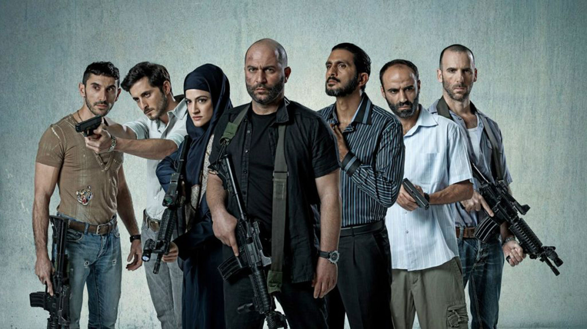

    
    
  
   
    
Año: 2015
Duración: 40 min.  
País: Israel  
Temporadas: 3  
Reparto: Lior Raz, Hisham Suliman, Shadi Mar'i, Laëtitia Eïdo, Rona-Lee Shim'on, Itzik Cohen 
  
Sinopsis:  
'Fauda' ("Caos" en árabe) narra cómo una cadena de peligrosos eventos se desata cuando Doron, un veterano agente israelí retirado, tiene que volver a la acción para intentar dar caza a Abu-Ahmed, un famoso activista palestino, militante de Hamas, al que todos daban por muerto.
