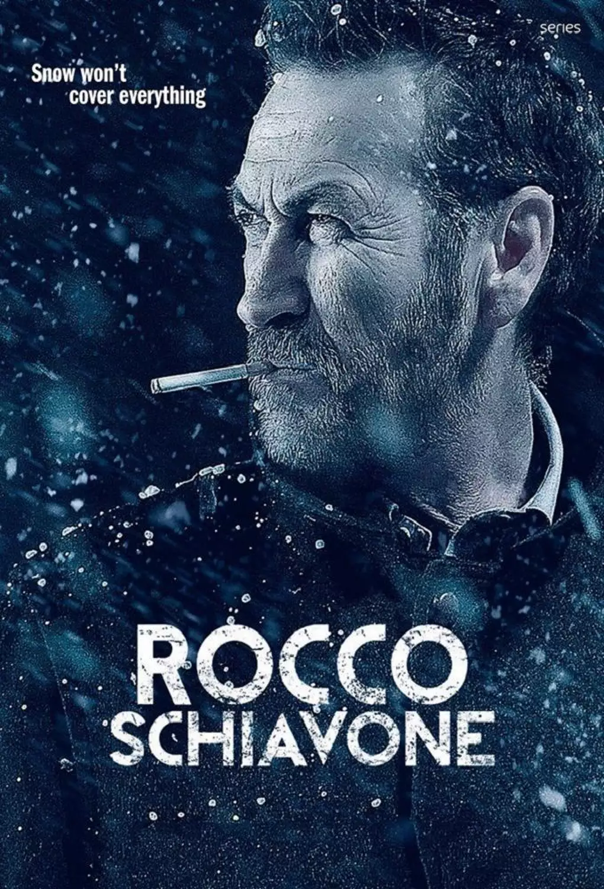

Año: 2016
Duración: 100 min.
País: Italia
Reparto: Marco Giallini, Claudia Vismara, Ernesto D'Argenio, Francesco Acquaroli, Isabella Ragonese, Francesca Cavallin, Fabio La Fata, Christian Ginepro, Massimiliano Caprara, Massimo Olcese, Massimo Reale

Sinopsis:
    Rocco Schiavone es un subcomisario de la policía estatal; romano hasta la médula, se encuentra destinado en la fría ciudad de Aosta, en el norte de Italia. Rocco es pedante, sarcástico en el sentido más "romano" del término, maleducado, y cínico hasta rabiar. Además odia su trabajo, y sobre todo odia Aosta. Pero tiene talento.

