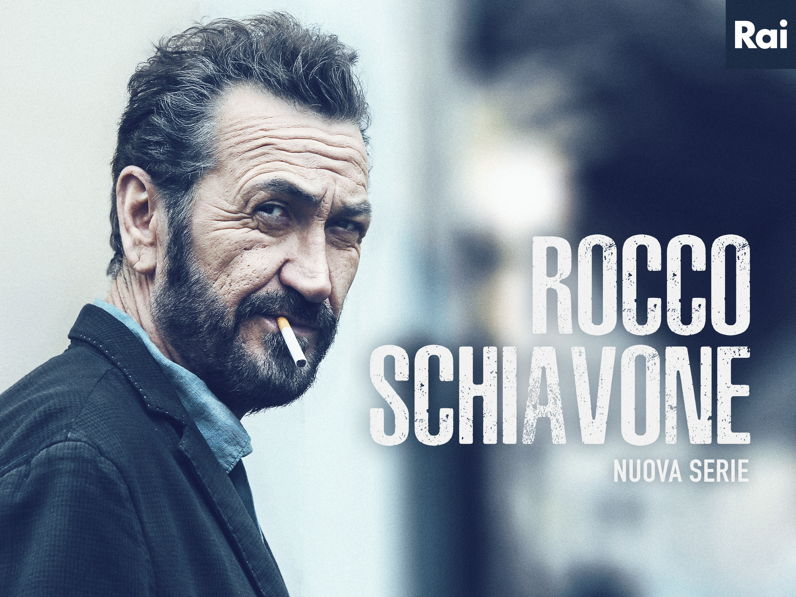

    
   

    
   
Año: 2016  
Duración: 100 min.  
País: Italia  
Reparto: Marco Giallini, Claudia Vismara, Ernesto D'Argenio, Francesco Acquaroli, Isabella Ragonese, Francesca Cavallin  
   
Sinopsis:  
Es el personaje principal de la serie, romano Trastevere, es el nuevo vice-comisario adjunto de Aosta, a donde llegó desde donde trabajaba antes, la ciudad de Roma. Fue trasladado por problemas disciplinarios. Se relaciona cercanamente con su trabajo, labor que debió escoger más por necesidad que por vocación, con una relación de amor-odio. Ello no elimina su talento para las investigaciones y su poder para resolver los casos.

Se comporta en casos de manera arrogante o despreciativo, con compañeros de trabajo como con sospechosos y criminales. Es colérico y se enfurece por los motivos más banales. Es fumador asiduo de marihuana.

El cambio de ciudad a Schiavone le resulta difícil y le cuesta adaptarse al nuevo entorno. Schiavone esta acostumbrado a hacer justicia por mano propia y esconde diversos crímenes cometidos en esto. Uno de estos crímenes es el asesinato de Luigi Baiocchi, asesino de Marina, esposa de Schiavone. Estos crímenes se encuentran en el eje central de la obra: Schiavone detiene las actividades criminales de Luigi Baiocchi, éste en búsqueda de venganza asesina a Marina y Schiavone por ello lo asesina.
